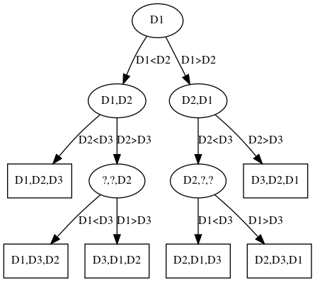

# Übung: Grundlagen, einfache Sortieralgorithmen (A1)

## 1 Grundlegende Zusammenhänge

**a)** Eine Möglichkeit wäre es die verschiedenen Dreiecke nach dem Flächeninhalt zu sortieren, eine weitere wäre die Sortierung nach dem Umfang.

**b)** Die Klasse `Triangle` implementiert das Interface `Comparable` und somit die
Methode `compareTo(Triangle o)`. Bei der `compareTo(Triangle o)` wird das aktuelle Dreieck mit einem übergebenen verglichen und liefert je nach Ausfall des Vergleiches einen Integer wert zurück.

- `return > 0`: das aktuelle Dreieck ist _grösser_ als das übergebene Dreieck
- `return 0`: beide Dreiecke sind _gleich_ _gross_
- `return < 0`: das aktuelle Dreieck ist _kleiner_ als das übergebene Dreieck

**c)** Die Methode `equals()` sollte immer mit der Methode `hashCode()` korrespondieren. Jedes Objekt, welche gleich sind _müssen_ auch den identischen HashCode liefern. Unterschiedliche Objekte _sollten_ auch unterschiedliche HashCodes liefern. Die Methoden `equals()` und `hashCode()` werden von der Klasse `Object` überschrieben.

**d)** Wenn neben der "natürlichen Ordnung" noch eine "spezielle Ordnung" implementiert werden soll, kann dies einfach über einen `Comparator` und der zugehörigen Methode `compareTo(Triangle a, Triangle b)` gemacht werden.

**e)** Die unten aufgeführten Klassen eignen sich für diese Anforderung.

- `Arrays.sort(Object[])` für die natürliche Ordnung
- `Arrays.sort(Object[], Comparator<? super T>)` für die spezielle Ordnung

Aus der JavaDoc:

    Implementation note: This implementation is a stable, adaptive, iterative
    mergesort...

`sort()` arbeitet _stabil_.

**f)** Kein UML notwendig bei Aufgabe **d)**

## 2 Entscheidungsbaum

**a)** 

**b)** Anzahl Blätter: `B = n! = 3! = 6`

Höhe Baum effektiv: `4`

Höhe: `h >= log2(6)+1 = 2.58 + 1 = 3.58`

Der Baum hat die Höhe `4 >= 3.58`. Die Formel stimmt für diesen Baum.

**c)** Es sind mindestens drei Vergleiche notwendig, um alle `n!` möglichen Ausgangssituation
differenzieren zu können.

## 3 Aus instabil mach stabil

**a)** Werte die in der Datenmenge mehrfach vorkommen müssen vor dem Sortieren indiziert werden, und nach dem Sortieren wieder in die Reihenfolge gebracht werden.

**b)** Im schlimmsten Fall hätte er die doppelte Ordnung des Ausgangsalgorithmus. Da aber 2 ein
konstanter Faktor ist, wäre der stabile Algorithmus die gleicher Ordnung wie der
instabile.