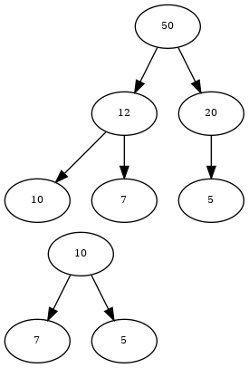

# Übung: Höhere Sortieralgorithmen (A2)

## 1 Quicksort – theoretisch durchgespielt

**a)** 

Trennelement: **17**

Erster Durchgang:

12 10 52~1~ 9 77 23 18 52~2~ 11 25 8 5 _17_

12 10 5 9 8 11 _17_ 52~2~ 23 25 77 52~1~ 18

Zweiter Durchgang:

12 10 5 9 8 _11_ | 17 | 52~2~ 23 25 77 52~1~ _18_

8 10 5 9 _11_ 12 | 17 | _18_ 23 25 77 52~1~ 52~2~

Dritter Durchgang:

9 10 5 _9_ | 11 12 17 18 | 23 25 77 52~1~ _52~2~_

8 5 _9_ 10 | 11 12 17 18 | 23 25 52~1~ _52~2~_ 77

Vierter Durchgang:

8 _5_ | 9 10 11 12 17 18 | 23 25 _52~1~_ | 52~2~ 77

_5_ 8 | 9 10 11 12 17 18 | 23 25 _52~1~_ | 52~2~ 77

Fünfter Durchgang

5 8 9 10 11 12 17 18 | 23 _25_ | 52~1~ 52~2~ 77

5 8 9 10 11 12 17 18 23 _25_ 52~1~ 52~2~ 77

**b)** Die Zahl 52~1~ war nach dem ersten Durchgang rechts von 52~2~. Dass die
Reihenfolge im zweiten Durchgang noch einmal (und zwar endgültig) änderte, ist
reiner Zufall. Quicksort arbeitet _instabil_.

**c)** Beim ersten Durchgang kämen 12 (Index 0), 18 (Index 6) und 17 (Index 12) in
Frage. Dadurch würde erneut 17 als Trennelement fungieren.

Beim zweiten Durchgang würde es links wiederum genau gleich ablaufen, rechts
würde aber mit 25 ein anderes Element verwendet werden. Das könnte die
Sortierung etwas beschleunigen und evtl. einen fünften Durchgang ersparen.

## 2 Quicksort - klassisch programmiert

**d)** 

 Elemente (`n`)   Messung (ms)
---------------  -------------
          1000           2
          5000           7
        10'000          12
        50'000          35
       100'000         133
       500'000        2993
     1'000'000      11'888

Beispiel: Um welchen Faktor müsste eine Sortierung mit 1'000'000 Elementen
länger dauern als eine Sortierung mit 500'000 bzw. 100'000 Elementen?

    (1'000'000 * log 1'000'000) / (500'000 * log 500'000) = 2.1
    (1'000'000 * log 1'000'000) / (100'000 * log 100'000) = 12

Realität:

    11'888 / 2993 = 3.97
    11'888 / 133 = 89.4

Das Laufzeitverhalten scheint eher `O(n²)` zu entsprechen (eine Verdoppelung der
Elemente führt zu einer Verfierfachung der Laufzeit; eine Verzehnfachung der
Elemente erhöht die Laufzeit ca. um Faktor 90).

## 3 Quick-Insertion-Sort

**a)** `m` ist der Schwellenwert, unter dem der Insertion-Sort verwendet werden soll

**b)** Ich sortiere 100'000 Zeichen mit verschiedenen `m`-Werten. Dabei erhalte
ich folgende Laufzeiten:

    m     Zeit (ms)
-----    ----------
    5       200
   10       172
   15       164
   20       141
   25       122
   30       119
   40       114
   50       122
   75       127
  100       123
  125       115
  150       110
  200       112
  250       110
  500       115
 1000       111

Bei einer Datenmenge von 100'000 Zeichen scheinen sinnvolle `m`-Werte von
25 bis 250 zu liegen.

**c)** Mit `m = 50` kann beim Quick-Insertion-Sort (QIS) gegenüber dem Quick-Sort
(QS) einen kleineren Laufzeitvorteil festgestellt werden:

       n    QS (ms)   QIS (ms)
-------- ---------- ----------
    1000          2          1
    5000          4          9
   10000          8         14
   50000         34         30
  100000        175        146
  500000       2766       2196

## 4 Datenstruktur Heap

**a)** 

## 5 Übersicht Sortieralgorithmen

**a)**

Algorithmus                          O avg        O worst     O best         stabil  parallel  Merkmale
------------------------------------ -----------  ----------  -------------  ------- --------- ---------
Direktes Einfügen (Insertion Sort)   O(n²)        O(n²)       O(n)           ja      nein      sortierter/unsortierter Teil; benachbartes Vertauschen
Direktes Auswählen (Selection Sort)  O(n²)        O(n²)       O(n²)          nein    nein      sortierter/unsortierter Teil; Vertauschen über weite Entfernungen
Direktes Austauschen (Bubble Sort)   O(n²)        O(n²)       O(n²)          ja      nein      Vergleich von jedem Element mit jedem
Shellsort                            O(n1.5)      O(n1.5)     O(n1.5)        nein    (ja)      Insertion Sort mit verschiedenen Schrittweiten; Hibbert Folge
Quicksort (`Arrays.sort()`)          O(n*log n)   O(n²)       O(n*log n)     nein    ja        Divide & Conquer; Sortierung um Teilerelement
Mergesort (`Collections.sort()`)     O(n*log n)   O(n*log n)  O(n*log n)     ja      ja        Divide & Conquer; Reissverschlussprinzip; Externes sortieren
Heapsort                             O(n*log n)   O(n*log n)  O(n*log n)     nein    nein      basiert auf Heap-Datenstruktur

**b)**
`java.util.Arrays.sort(...)`: Quicksort

`java.util.Arrays.parallelSort(...)`: parallel Mergesort

`java.util.Collections.sort(...)`: Mergesort