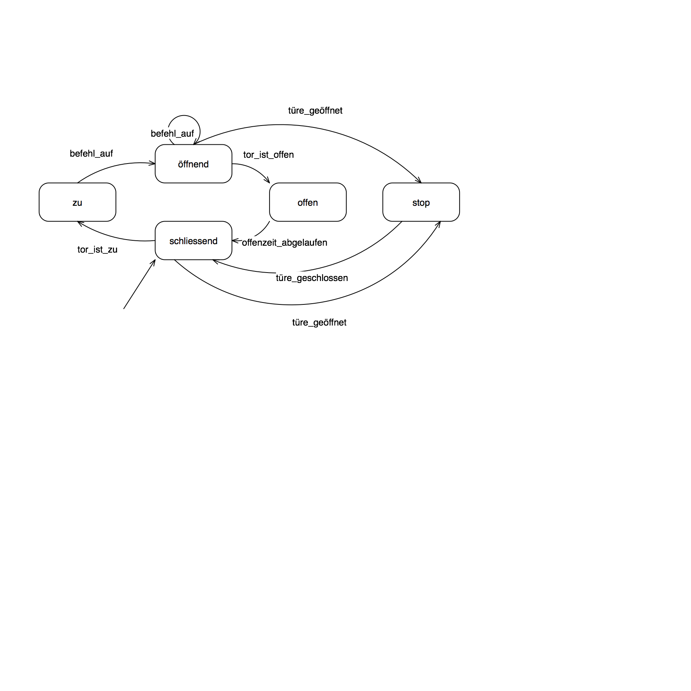
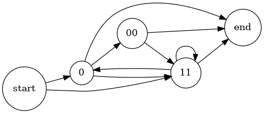

# Übung: Endliche Automaten und formale Sprachen (A3)

## 1 Automat – Maschinensteuerung

## 2 Automat – Garagentorsteuerung

## 3 Formale Grammatik

**a)**
Beispiel der Typ-1-Grammatik:

    G = (N, T, P, s)
    N = {s, A, B}
    T = {a, b, c}
    P = {s → abc, s → aAbc, Ab → bA, Ac → Bbcc, bB → Bb, aB → aaA, aB → aa}

Erzeugung des Wortes `aabbcc`:

    s → aAbc → abAc → abBbcc → aBbbcc → aabbcc

**b) Erzeugung des Wortes `aaabbbccc`:**
    s → aAbc → abAc → abBbcc → aBbbcc → aaAbbcc → aabAbcc → aabbAcc → aabbBbccc → aabBbbccc → aaBbbbccc → aaabbbccc

**c)**
Weil die Ersetzung eines Nichtterminalsymbols (z.B. `A`) vom Kontext, d.h. von
den benachbarten Terminalsymbolen (z.B. `a`) abhängig ist. `A` von `b` gefolgt
wird durch etwas anderes ersetzt als `A` von `c` gefolgt.

## 4 Formale Grammatik

G = (N, T, P, s)
N = {s, A, B}
T = {0, 1, 2}
P = {s → A, A → 0A0, A → 1A1, A → 2A2, A → B, B → 0, B → 00, B → 1, B → 11, B → 2, B → 22}

**a)**
1. `s → A → B → 0`
2. `s → A → 0A0 → 0B0 → 000`
3. `s → A → 0A0 → 0B0 → 010`
4. `s → A → 0A0 → 00A00 → 002A200 → 002B200 → 0021200`

**b)**
Gegeben sei eine Grammatik bestehend aus den Nichtterminalsymbolen s, A und B;
aus den Terminalsymbolen 0, 1 und 2 und folgenden Regeln:

- aus s kann ein A werden
- aus A kann
    - ein 0A0,
    - ein 1A1
    - ein 2A2,
    - oder ein B werden
- aus B kann
    - eine 0,
    - eine 00,
    - eine 1,
    - eine 11,
    - eine 2,
    - oder eine 22 werden.

**c)**
Die Grammatik ist hier von **Typ 2**, kontextfrei. Weil die linkeSeite nur ein einziges Nichtterminalsymbol zulässt.

- Ableitungsbaum (Syntaxbaum)
- Syntaxdiagramm
- BNF / EBNF

**d)**
TODO

## 5 EBNF

a. `11`: ja
b. `01110`: ja
c. `01111`: nein
d. `01011010`: nein
e. `0111000`: ja
f. `1100`: ja
g. `0011`: nein
h. `01001111`: nein

## 6 Syntaxdiagramme

## 7 Wortproblem mit Hilfe eine DEA lösen

-> see Java project

## 8 Formale Sprache definieren

**a)**

**b)**
    <Sprache>::=0<Körper>
    <Körper>::={11[0]}

**c)**
    0(11(0)?)*

## 9 Optional: State Design Pattern

TODO