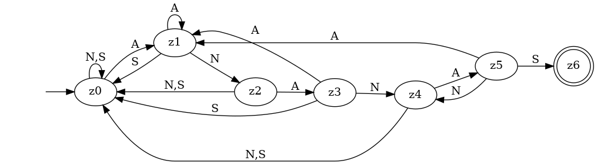
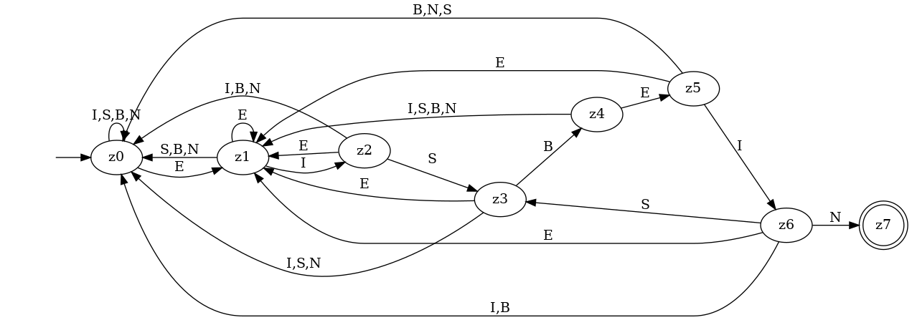
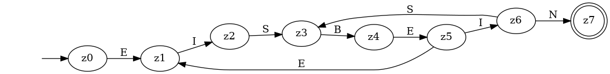
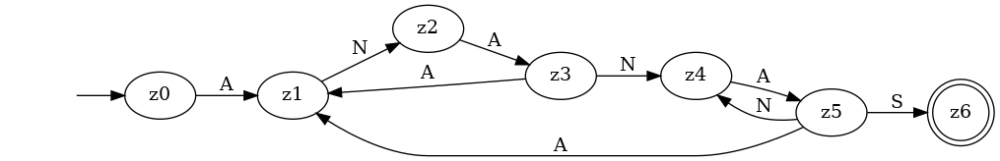

# Übung: Suchalgorithmen (A4)

## 1 Einfache Suche

Zeichenkette: `aaaaaaaaaaaaaaaaaaa...a`
n = `100'000`
Pattern Länge m = `10`

**a)**
Jedes Pattern, das nicht mit `a` beginnt, führt zu einer **minimalen Anzahl (best case)** Zeichenvergleiche:

`n-m+1 = 100'000-10+1 = 99'991` Vergleiche

**b)**
Jedes Pattern, das aus neun `a`s und einem anderen Zeichen besteht, führt zu einer **maximalen Anzahl (worst case)** Zeichenvergleichen:

`m*(n-m+1) = 10*(100'000-10+1) = 10*99'991 = 999'910` Vergleiche

**c)**
Im besten Fall sind es `n-m+1`, im schlechtesten Fall `m*(n-m+1)` Vergleiche.

    m       n  Vergleiche (best)  Vergleiche (worst)
 ---- ------- ------------------ -------------------
    2       8                  7                  14
    4      16                 13                  52
    8      32                 25                 200
   16      64                 49                 784

Im **besten Fall** führt eine Verdoppelung von m _und_ n zu einer Verdoppelung der Anzahl Vergleiche.

Im **schlechtesten Fall** führt eine Verdoppelung von m _und_ n zu einer Vervierfachung der Anzahl Vergleiche.

Die einfache Suche hat die **Ordnung** `O(m*(n-m))`

## 2 Optimierter Suchautomat

**a)**
Im Gegensatz zur einfachen Suche muss beim optimierten Suchautomat beim einem gescheiterten Vergleich **nicht zwangsläufig das ganze Muster noch einmal von vorne verglichen werden**. Das „fehlerhafte“ Zeichen bzw. die „fehlerhafte“ Zeichensequenz könnte nämlich der Anfang des Suchmusters sein.

**b)**

**c)**

**d)**
Die beiden erstellten Suchautomaten arbeiten mit einem Alphabet von drei bzw. fünf verschiedenen Zeichen, während binäre Patterns mit einem Alphabet von zwei
Zeichen (`1` und `0`) auskommen.
Das erfordert **mehr Fallunterscheidungen**.

## 3 Musterautomat und KMP-Algorithmus

**a)**
Teilwort  Zustand  Rand  Länge  Folgezustand
--------- -------- ----- ------ -------------
E         z1       -     0      z0
EI        z2       -     0      z0
EIS       z3       -     0      z0
EISB      z4       -     0      z0
EISBE     z5       E     1      z1
EISBEI    z6       EI    2      z2
EISBEIN   z7       -     0      z0

**b)**

**c)**
Teilwort  Zustand  Rand  Länge  Folgezustand
--------- -------- ----- ------ -------------
A         z1       -     0      z0
AN        z2       -     0      z0
ANA       z3       A     1      z1
ANAN      z4       AN    2      z2
ANANA     z5       ANA   3      z3
ANANAS    z6       -     0      z0

**d)**
TODO

**e)**
Die Methode `initNext(String pattern)` gibt die Randlängen zurück:

* "EISBEIN": `[-1, 0, 0, 0, 0, 1, 2]`
* "ANANAS": `[-1, 0, 0, 1, 2, 3]`

**f)**
Getestet mit dem implementierten KMP-Algorithmus.

* "EISBEIN"
    * Expected: `[-1, 0, 0, 0, 0, 1, 2]`
    * Actual: `[-1, 0, 0, 0, 0, 1, 2]`
* "ANANAS"
    * Expected: `[-1, 0, 0, 1, 2, 3]`
    * Actual: `[-1, 0, 0, 1, 2, 3]`

## 4 Quicksearch

**a)**
Das `shift`-Array ergibt sich aus dem Alphabet. Dieses enthält sämtliche im "haystack" (möglicherweise) vorkommenden Zeichen. Die Zahlenwerte im `shift`-Array liegen im Bereich 1 (MIN) und Länge des Musters plus 1 (MAX).

**b)**
* Alphabet: `A={a,b,c,d,e,f,g,h,i}`
* Pattern: `"gaga"`
* `shift`-Array: `[a=1,b=5,c=5,d=5,e=5,e=5,f=5,g=2,h=5,i=5]`

**c)**
* extrem schnell
    * Alphabet: `A={a,b,c,x,y,z}`
    * Zeichenkette: `"abcabcxyz"`
    * Muster: `"xyz"`
    * `shift`-Array: `[a=4,b=4,c=4,x=3,y=2;z=1]`
    * Anzahl Vergleiche: 6
* extrem langsam
    * Alphabet: `A={a,b}`
    * Zeichenkette: `"aaaaaaaaaaaaaaaaaaaaaaaab"`
    * Muster: `"ab"`
    * `shift`-Array: `[a=2,b=1]`
    * Zeichenvergleiche: 26 (Länge der Zeichenkette)