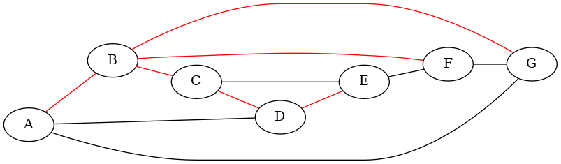

# Übung: Graphen (A5)

## 1 Begriffe und Eigenschaften

### 1.1 Lernziele

* Begriffe und Eigenschaften von Graphen kennen
* Entsprechende Graphen beispielhaft aufzeichnen können

### 1.2 Grundlagen

Diese Aufgabe basiert auf dem AD-Input "A51_IP_Graphen". Die Aufgabe beinhaltet keine Programmierung.

### 1.3 Aufgaben

**a)**

Siehe Abbildung 1.

**b)**

Siehe Abbildung 2.

**c)**

Siehe Abbildung 3.

**d)**

|E| = |V| - 1

**e)**

Siehe Abbildung 4.

**f)**

Siehe Abbildung 5.

**g)**

Siehe Abbildung 6.

## 2 Besetzung eines Graphen

### 2.1 Lernziele

* Dicht und dünn besetzte Graphen unterscheiden können
* Zweckmässige Überlegungen betreffend deren Implementierung machen können

### 2.2 Grundlagen

Diese Aufgabe basiert auf dem AD-Input "A51_IP_Graphen". Die Aufgabe beinhaltet keine Programmierung.

### 2.3 Aufgaben

**a)**

Siehe Abbildung 7 (dünn besetzter Graph) und Abbildung 8 (dicht besetzter
Graph).

**b)**

Beim dünn besetzten Graph gilt `|E| < |V|^2`, beim dicht besetzten Graph `|E| ~= |V|^2`.

**c)**

In meinem "dünnen" Beispiel sind es 7 Knoten und 6 Kanten. Im "dichten" Beispiel sind es 7 Knoten und 21 Kanten. `|V|^2` wäre hier also zu gross, obwohl jeder Knoten mit jedem verbunden ist.

**d)**

Bei einem ungerichteten Graph ist es die Summe von `(|E|-1)+(|E|-2)+...+1`.

Bei einem gerichteten Graph doppelt so viel.

Im Minimum sind es `0` Kanten.

**e)**

Für dicht besetzte Graphen ist eine Adjazenzmatrix sinnvoll, da diese symmetrisch ist und man gut die Hälfte des Speicherplatzes einsparen kann.

Bei dünn besetzten Graphen sind Adjazenzlisten sinnvoll.