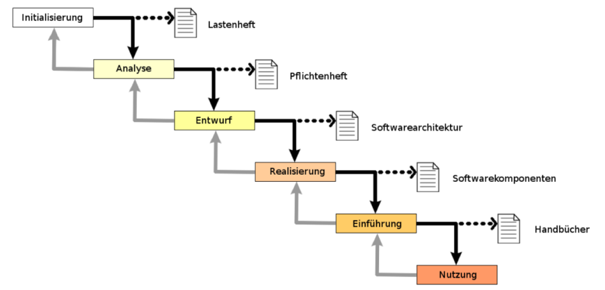
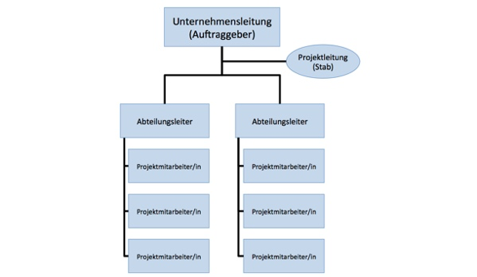
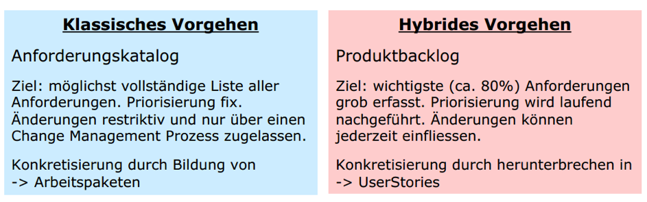

# Project Management Basic

## 1 Projekt Management Grundlagen

### 1.1 Lernziele

1. LZ1: Sie kennen die Grundbegriffe im Projektmanagement und können Projekte von anderen Unterfangen unterscheiden.
2. LZ2: Sie kennen wesentliche Faktoren die zum Projekterfolg beitragen und wissen, aus welchen Gründen Projekte scheitern.
3. LZ3: Sie kennen die aktuellen Kategorien der Vorgehensmodelle und können deren wesentliche Elemente und die Unterschiede erklären.
4. LZ4: Sie kennen die verschiedenen Projektorganisationsformen und typische Rollen und Gremien der Projektinstitution.
5. LZ5: Sie kennen die Grundzüge des SoDa Vorgehensmodells.

### 1.2 Grundbegriffe

LZ1: Sie kennen die Grundbegriffe im Projektmanagement und können Projekte von anderen Unterfangen unterscheiden.

#### 1.2.1 Projekt

**Was ist ein Projekt?**

Projekte sind in sich abgegrenzte, komplexe und / oder komplizierte Aufträge, deren Erfüllung eine Organisation bedingt, die für die Umsetzung der Tätigkeiten eine Projektmethode anwendet, mit der alle anfallenden Arbeiten geplant, gesteuert, durchgeführt und kontrolliert werden können.

**Was sind Merkmale eines Projektes?**

* Begrenzte Ressourcen (Zeit, Aufwand, Leistung)
* Einmalig
* Begrenzte Dauer
* Komplexe Aufgabenstellung
* Bedarf einer Organisation (Projektmethode anwenden)
* Sollte messbare Resultate haben

#### 1.2.2 Komplex vs. Kompliziert

**Komplexe Probleme** müssen durch probieren, erkennen und reagieren, iterativ gelöst werden.

**Komplizierte Probleme** können durch erkennen, analysieren und reagieren, linear gelöst werden.

#### 1.2.3 Teufelsquadrat

#### 1.2.4 Projektmanagement

Das Projekt führen, koordinieren, steuern und kontrollieren.

### 1.3 Projekterfolg und -misserfolg

LZ2: Sie kennen wesentliche Faktoren die zum Projekterfolg beitragen und wissen, aus welchen Gründen Projekte scheitern.

**Wie äussert sich ein Projekterfolg und -misserfolg?**

**Projekterfolg** wird gleichgesetzt mit dem Erreichen des vorgegebenen Ziels/Produkts, ohne den festgelegten Zeit- und Kostenrahmen überschritten zu haben.

**Projekterfolg** kann auch gegeben sein, wenn aus dem Projekt einen Nutzen gezogen werden kann, unabhängig davon ob sich das Projekt verspätet oder teurer wird. Jedoch wird der Nutzen (nach Abschluss des Projektes) eher selten oder fast gar nicht gemessen.

**Projektmisserfolg** ist in Umkehr dieser Aussage, das Überschreiten von Zeit oder Kosten oder die Nichterfüllung der Produktfunktionalität.

**Welche Schlüsselfaktoren tragen zum Projekterfolg bei?**

* Unterstützung von der GL (Finanziell oder Motivation)
* Emotionale Reife (man muss führen können, man muss geduldig sein und die Leute mögen)
* Benutzer involvieren (Zukünftige Benutzer involvieren)

**Aus welchen Gründen scheitern Projekte?**

* Fehlende Erfahrung in Projektleitung
* Unzureichende Projektplanung
* Fehlende Projekt Methodiken
*Fehlendes Projekt Controlling

**Was ist das Magische Dreieck?**

Um bei einer Aufgabe, die Erwartungen an ein Projekt so weit wie möglich zu erfüllen, bewegt man sich zwischen drei Grössen:

* **Zeit:** Projektdauer und Termine
* **Kosten:** Ressourcen (Budget, Personal)
* **Leistung:** Inhalt (Umfang und Qualität)

Diese drei Grössen stehen in Zielkonkurrenz zueinander, eine Änderung an einer Grösse führt zu Änderungen an einer oder beiden anderen Grössen.

### 1.4 Vorgehensmodelle

LZ3: Sie kennen die aktuellen Kategorien der Vorgehensmodelle und können deren wesentliche Elemente und die Unterschiede erklären

Die Projektführung hat in fast allen Projekten die gleichen Aufgaben aber mit unterschiedlichen Ausprägungen. Bei der Projektdurchführung gibt es je nach Projektart oder Vorgehensmodell Unterschiede.

Unter einem Vorgehensmodell versteht man eine projektübergreiffende Regelung, wie Aktivitäten oder Ergebnisse umgesetzt bzw. bearbeitet werden.

**Nenne die Vorgehensmodelle des klassischen Projekts-Managements inkl. deren Eigenheiten**

* Wasserfallmodell
    * Sehr starres Vorgehen
    * Wenig Flexibilität
    * Bei geänderten Anforderungen müssen diese in einen komplett neuen Zyklus integriert werden
* V-Modell
    * Starres Vorgehen
    * Wird beim Abnahmetest festgestellt, dass die Anforderungen unzureichend spezifiziert wurden, kann dies zu einem Projektabbruch führen
    * Anpassungen der Anforderungen verursacht hohe Kosten

#### 1.4.1 Klassisch

**Wasserfall Modell**

* Initialisierung
* Analyse
* Entwurf (Design)
* Realisierung
* Einführung
* Nutzung

Treten neue oder geänderte Anforderungen an die Software auf, müssen diese in einem komplett neuen Zyklus umgesetzt werden. Dies ist ein sehr starres Vorgehen, welches wenig Flexibilität bietet. Kritisch wird dieses Vorgehen, wenn in einer Phase erkannt wird, dass die vorherige Phase unvollständige Ergebnisse geliefert hat.

**V-Modell**

Die Phasen laufen von links oben nach unten und dann von rechts unten nach rechts oben. Zu jeder Phase auf der Linken-Seite gibt es die entsprechende Test-Seite auf der rechten Seite.

Wird allerdings in Phase 6 bei der Abnahmeprüfung festgestellt, dass die Anforderungen in Phase 1 unzureichend verstanden wurden, dürfte dies in den meisten Fällen zum Projektabbruch und damit zum Scheitern des Projektes führen. Es ist dabei zu beachten, dass in großen Projekten zwischen Analyse (Phase 1) und Systemabnahme (Phase 6) durchaus mehrere Jahre liegen können.

**Nachteile**

Als Nachteil eines V-Modells oder eines Wasserfallmodels, ist die mangelnde Flexibilität anzusehen. Auf ändernde Anforderungen kann nur schlecht reagiert werden, was hohe Kosten verursacht.

#### 1.4.2 Agil

**Was sind wesentliche Elemente von einer agilen Software Entwicklung?**

* Agil: Neue, geänderte Anforderungen können eingebunden werden
* Iterativ: Liefert Produkte in regelmässigen Abständen (potenziell lieferbare Software)
* Inkrementell: Software wird stufenweise aufgebaut, Gelegenheiten für Feedback wird maximiert

**Ab wann ist das agile Vorgehensmodell empfehlenswert?**

* Mitarbeiter Anzahl <= 10
* komplexe Produkte

**Was ist Scrum und wie ist es aufgebaut?**
Scrum ist agil, iterativ und inkrementell. Scrum stützt sich auf die folgenden drei Säulen:

* Transparenz (z.B. gegenüber dem Kunden)
* Überprüfung
* Anpassung

Scrum ist vor allem für die Entwicklung komplexer Produkte gedacht.

Die Scrum Teams liefern Produkte in regelmässigen Abständen (iterativ) und stufenweise erweiternd (inkrementell). Dadurch werden auch die Gelegenheiten für Feedbacks maximiert. Die inkrementelle Lieferung der Produkte stellt sicher, dass immer eine potentielle gebrauchsfähige und nutzbare Version des Produktes zur Verfügung steht. So kann diese dem Kunden jederzeit präsentiert werden.

**Aus welchen Elementen besteht ein Sprint?**

Der Sprint ist das Herz von Scrum.
Er besteht aus:

* Sprint Planung
* Daily Meetings
* Entwicklungsarbeit
* Sprint - Abnahme
* Sprint - Retrospektive

Die Sprints haben während des Projektes eine gleichmässige, feste Dauer (time Boxing). Während eines Sprints wird ein fertiges, getestetes, nutzbares und potentiell auslieferbares Produkt inkrementell entwickelt.

**Was ist das Produkte Backlog?**

Die Produkte Backlog Verwaltung enthält alle Anforderungen in einer geordneten und zielführenden Fertigstellungsreihenfolge.

Das ProductBacklog ist eine priorisierte Liste aller aktuell bekannten Epics bzw. Stories. Es ist ein lebendes Artefakt, jeder Eintrag enthält eine Beschreibung, die Priorität, die Aufwandschätzung und den Wert (Nutzen). Die Detailplanung erfolgt rollend im SprintBacklog!

Das Produkte Backlog muss laufend gepflegt werden („Grooming“). Diese Anforderung hätte im Sprint 2 abgehandelt werden sollen, aber es hat nicht mehr gereicht, also wird diese in den Sprint 3 eingeplant. Der Product Owner entscheidet über das Grooming ob und bis wann eine Anforderung im Projekt realisiert wird.
Die Sprintplanung findet zu Beginn eines Sprintes statt.

Die Sprint Planung wird zusammen mit dem Entwicklungsteam verhandelt damit Zielkonflikte aufgelöst werden können.

Der Sprint-Abschluss welcher am Ende jedes Sprints stattfindet, wird ermittelt welche Funktionen akzeptiert und freigeben werden.

Software entwickelt sich von Sprint zu Sprint inkrementell. Ganzes Projekt wird in Sprints unterteilt und stellt den Arbeitszyklus dar. Kurze Iterationen, bei denen inkrementell entwickelt wird. Durch kurze Iterationen und kurze Release-Zyklen wird schnelles Feedback beim Kunden über den Fortschritt und Funktionsumfang eingeholt. Dieses schnelle Feedback dient zur Steuerung der weiteren Entwicklung.

**Rollen:**

* Product Owner:
    * Vertritt die Anwender des Produkts oder Stakeholder
    * Verantwortlich für das Produkt
    * Erstellt Anforderungen
    * Erstellt Release Plan für das Produkt
    * Priorisiert Anforderungen aus dem Backlog
* Scrum Master:
    * Stellt sicher, dass die Regeln und Schritte im Projekt eingehalten werden
    * Hilft bei methodischen Problemen
* Scrum Team:
    * Zwischen 5 bis 10 Mitarbeiter im Best Case

**User Stories:**

Enthält Anforderung aus Benutzersicht, z.B. als registrierter Reisende sehe ich in einer Übersicht alle meine gebuchten Reisen.

**Product Backlog:**

Quelle wo alle Anforderungen enthalten sind.
Enthält:

* Anforderungen (User Storys)
* Unkritische Fehler (Kritische wandern in das Sprint Backlog)
* Forschungsaufträge

**Sprint Backlog:**

Anforderungen welche erfüllt werden müssen um ein Sprint umzusetzen, Fehler die schnell behoben werden müssen. Die Fehler kommen aus dem Product Backlog.

**Ticket:**

Befinden sich im Sprint, dass sind die einzelnen Anforderungen basierend auf den Story Cards, welche ausgeführt werden müssen.

**Iterativ:**

Beschreibt ein Vorgehen in nacheinander folgenden Iterationen, ein Verfahren der schrittweisen Annäherung  an die exakte oder endgültige Lösung. Eine Iteration ist eine zeitlich und fachlich in sich abgeschlossene Einheit.

Dabei werden in jeder Iteration alle Projektphasen durchlaufen. Jede abgeschlossene Iteration liefert einen funktionierenden Zwischenstand des Produkts – einen inkrementellen Release.

**Inkrementell:**

Inkrementell (kleine Stufe der Zunahme) bedeutet, dass mit jeder Iteration zusätzliche Funktionalität hinzugefügt wird.

**Scrum im Überblick:**

1. Anforderungen in Story Cards

    Aus dieser ersten, aber anschaulichen und verständlichen Vision lassen sich die einzelnen Elemente und Merkmale des Produkts ableiten, die zu entwickeln sind. Das sind die konkreten Anforderungen und einzelne Funktionalitäten, die in sogenannten Story Cards in den Worten der Anwender formuliert werden - nicht im Jargon der Techniker. Damit wird auch sichtbar, welche Ressourcen das Projekt braucht (Qualifikationen im Projektteam und grober Aufwand für die Umsetzung).

2. Arbeitspakete im Product Backlog

    Aus diesen Anforderungen des Produkteigners wird ein sogenanntes Produkt-Backlog zusammengestellt. Das ist eine Sammlung sämtlicher Funktionen und Merkmale, die das Produkt haben soll. Am Anfang ist diese Zusammenstellung noch grob, doch im Projektverlauf wird sie immer genauer.

3. Prioritäten

    Im nächsten Schritt werden Prioritäten vergeben. Welche Elemente und Funktionen sind am wichtigsten im Sinne von: Das sichert die Zufriedenheit der Anwender essenziell. Andere Anforderungen sind nicht so wichtig, können aussortiert werden, werden mit anderen zusammengelegt, sind technisch nicht realisierbar oder werden verschoben. Sie werden dann bei der Überarbeitung oder bei der Erweiterung des Produkts behandelt.

4. Sprint Planung

    Zu jedem Beginn der Sprint-Planung erstellt der Product-Owner gemeinsam mit dem Team das neue Sprint-Ziel. Es wird geprüft, wie viele der höchst priorisierten Backlog-Items in das Sprint-Backlog übernommen werden können. So dass:

    * Ein sinnvolles Sprintziel entsteht
    * Mit den verfügbaren Ressourcen
    * Via Timeboxing Verfahren durchgeführt werden kann.

5. Aufgaben im Sprint Backlog

    Eine einzelne Aufgabe, die dann zu erledigen ist, wird Ticket genannt. Alle Tickets sind im sogenannten Sprint-Backlog aufgeführt. Das ist gewissermaßen der Maßnahmenplan und der Arbeitsvorrat für das Entwickler-Team für den nächsten Arbeitszyklus, der sogenannte Sprint. Jedes Teammitglied übernimmt eigenverantwortlich einzelne Ticket (Verpflichtungserklärung).

6. Arbeitsprozesse im Sprint

    Im Sprint arbeiten die Teammitglieder an ihren Aufgaben, den Tickets. Hier werden Teillösungen gemäß dem Sprint-Backlog (Aufgabenplan) entwickelt.

7. Besprechungen im Scrum

    Während des täglichen, 15 minütigen Treffens, dem sogenannten Scrum, berichtet jeder der Reihe nach: Was er seit dem letzten Scrum gemacht hat, was er bis zum nächsten Scrum tun wird und was ihn bei seiner Arbeit behindert. Der Scrum-Master muss diese Hindernisse aufgreifen und helfen, dass sie beseitigt werden. In einem Sprint Burndown Chart wird sichtbar gemacht, wie das Projekt voranschreitet.

8. Fortschrittskontrolle im Sprint Review Meeting

    Jeder Sprint wird durch ein Sprint Review Meeting abgeschlossen. Das Team stelle die Ergebnisse dem Produkteigner vor. Er muss sie akzeptieren und abnehmen. In gesonderten Treffen können auch die Teammitglieder ihre Zusammenarbeit überprüfen und festhalten, was intern verbessert werden sollte. Die Erkenntnisse sollten für zukünftige Scrum Projekte genutzt werden; so wird ein Lernprozess unterstützt.

9. Projektabschluss

    Sind alle Sprints durchlaufen, wird das fertige Produkt an den Produkteigner geliefert. Das Projekt kann abgeschlossen werden.

**Kritik:**

* Nur bis ca. 10 Mitarbeiter geeignet
* Oft macht es mehr Sinn die Anforderungen zu spezifizieren als User Storys niederzuschreiben

#### 1.4.3 Hybrid

**Was ist ein hybrides Vorgehen in einem Projekt?**

Eine Kombination aus verschiedenen Vorgehensmodellen bezeichnet man als hybrides Vorgehensmodell. Als Beispiel Gesamtprojektsteuerung und Teilprojekte "X" und "Y" wurden nach dem klassischen Vorgehensmodell arbeiten. Das Teilprojekt "Z" wurde dagegen mit dem agilen Vorgehensmodell "SCRUM" durchgeführt.

#### 1.4.4 Klassisch vs. Agil

**Gegenüberstellung Klassisch / Agil, was ist bei wem fix und was ist bei wem variabel (Leistung und Aufwand)?**

Je nach dem um welches Projekt es sich handelt muss das entsprechende Vorgehensmodell gewählt werden.

Beim klassischem Modell ist die Leistung fix. Als Beispiel: die Einführung einer Lagersoftware im Dezember. Aufgrund der erwarteten Funktionen, also welche Funktionen werden benötigt, rechnet man dann die Zeit und der Aufwand.

Beim agilen Modell ist die Zeit und der Aufwand fix. Als Beispiel: Neues Produkt, Entwicklung einer Labor Software. Die Leistung ist also variabel und es kann auch möglich sein, dass wen die Zeit und der Aufwand zu Ende geht, nicht alle Leistungen im Projekt enthalten sind.

Klassisch:

* Alle Anforderungen sind vollständig definiert und festgeschrieben
* Zeitraum ist geplant
* Aufwand muss evtl. erhöht werden um die Fertigstellung zu garantieren

Hybrid / Agiles:

* Wichtigsten Anforderungen sind grob beschrieben und priorisiert, vollständige Umsetzung ist jedoch nicht festgeschrieben
* Anforderungen werden laufend in den Sprints konkretisiert und umgesetzt, so entsteht praktisch nach jedem Sprint eine lauffähige Software
* Aufwand ist festgelegt und wird gesteuert

### 1.5 Projektorganisationsformen

LZ4: Sie kennen die verschiedenen Projektorganisationsformen und typische Rollen und Gremien der Projektinstitution

**Welche Projektorganisationen gibt es?**

* Reine Projektorganisation
* Matrixprojektorganisation
* Stablinien Projektorganisation

Es wird also zusätzlich zum Organigramm eine Projektorganisation gebildet, die die Zusammenstellung der Rollen, Befugnisse und Schnittstellen eines Projektes beschreibt. Und damit ist die Projektorganisation für den Projekterfolg von zentraler Bedeutung.

Denn nur, wenn alle beteiligten Personen wissen, welche Aufgaben, Verantwortungen und Befugnisse sie innerhalb eines Projektes haben (und wie sich diese zur Stammorganisation verhalten), können sie sich auch dementsprechend (richtig) verhalten.

**Eine Projektorganisation** enthält Aufbau- und Ablauforganisation eines bestimmten Projektes. Problem einer Projektorganisation: Es ist meist ungenau oder gar nicht definiert welche Verantwortung (finanziell, fachlich, administrative) ein Projektleiter hat.

#### 1.5.1 Reine Projektorganisation oder Linien Projektorganisation

**Definition:**

Alle Projektmitarbeiter werden aus ihren jeweiligen Abteilungen abgezogen und vollständig der Projektorganisation zugeordnet.

**Vorteile:**

* Klare Befugnisse, Verantwortungen
* Einfache Kommunikationswege

**Nachteile:**

* Schwächung der Stammorganisation, da die Mitarbeiter komplett in die Projekte eingegliedert werden
* Leerlaufzeiten, es können im Projekt einzelne Mitarbeiter zu wenig oder zu viel ausgelastet sein

**Projektleiter Aufgaben:**

* Fachliche Weisungsbefugnis
* Disziplinarische Weisungsbefugnis
* Volle Zeilverantwortung

#### 1.5.2 Matrix Projektorganisation

**Definition:**

Hier bleiben die Mitarbeiter in ihren jeweiligen Abteilungen und die Weisungsbefugnisse werden zwischen Stamm- und Projektorganisation aufgeteilt. Jeder Abteilungsleiter behält die disziplinarische Weisungsbefugnis über seine Mitarbeiter. Der PL hat bis zu einem bestimmten Prozentsatz Zugriff auf die Mitarbeiter. Muss aber auf das Tagesgeschäft innerhalb den Abteilungen schauen. Dadurch ist der Abstimmungs-/Kommunikationsbedarf zwischen Projektleiter und Abteilungsleiter, aber auch mit den Mitarbeitern deutlich höher als bei der autonomen Projektorganisation.

**Vorteile:**

* flexiblen Ressourceneinsatz (Mitarbeiter können am Tagesgeschäft oder Projekt arbeiten)
* Wissensaustausch zwischen Projekt- und Stammorganisation möglich
* Keine Konflikte durch spätere Reintegration in die Stammorganisation

**Nachteile:**

* Gefahr der Mitarbeiter überlastung
* Hoher Abstimmungsaufwand zwischen Abteilung und Projekt

**Projektleiter Aufgaben:**

* fachliche Weisungsbefugnis
* keine disziplinarische Weisungsbefugnis
* volle Zielverantwortung

#### 1.5.3 Stablinien Projektorganisation

**Definition:**

Bei der Stablinien Projektorganisation ist der Projektleiter nur koordinierend und beratend tätig. Er wird in einer sogenannten Stablinie zwischen Unternehmens- und Abteilungsleitung angesiedelt. Deshalb heisst diese Organisationsform auch Stablinien Projektorganisation.

**Vorteile:**

* Einfacher Wissensaustausch
* Keine organisatorische Anpassung notwendig

**Nachteile:**

* Sehr hoher Koordinationsaufwand
* Starke Belastung Stammorganisation

**Projektleiter Aufgaben:**

* Keine fachliche Weisungsbefugnis
* Keine disziplinarische Weisungsbefugnis
* dadurch keine Zieleverantwortung

#### 1.5.4 Rollen und Gremien

**Was sind die typischen Rollen im agilen / hybriden Vorgehen?**

* Projektleiter
* SCRUM Master
* Entwicklungsteam
* Product Owner

**Was sind die typischen Rollen beim klassischen Vorgehen?**

* Projektleiter
* Fachgremium
* Projekt Mitarbeiter
* projekt Office

### 1.6 SODA

LZ5: Sie kennen die Grundzüge des SoDa Vorgehensmodells

**Welche Phasen sind beim SoDa agil / welche klassisch und für welches Vorhaben eignet sich das SoDa Modell?**

* Agil: Konzeptions- und Realisierungsphase
* Klassisch: Einführung, Nutzung

Beim SoDa Modell verläuft Konzeptions- und Realisierungsphase wie bei Scrum. Die anderen Phasen werden eher wie beim klassischen Model gehalten. Somit ist während der Entwicklung ein agiles Vorgehen möglich. Jedoch sind die anderen Phasen geordnet.

**Grundlagen SoDa**
SoDa basiert auf dem Vorgehensmodell Scrum und bindet dieses in einen Projektmanagement-Rahmen ein.

Es gibt 4 verschiedene Rollen:

* Scrum Team
* Product Owner
* Scrum Master
* Projektleiter

**Für welche Projekte eignet sich SoDa?**
Im Fokus sind Software-Entwicklungsvorhaben mit kleineren Teams über einige Monate.

## 2 Projektplanung

### 2.1 Lernziele

1. LZ1: Sie können für ein kleines bis mittleres Projekt eine Projektplanung vollständig durchführen.
2. LZ2: Sie sind in der Lage dies für ein klassisches Projekt basierend auf Arbeitspaketen und für ein agiles respektive hybrides Projekt zu tun.
3. LZ3: Sie sind in der Lage, aus der Beschreibung der Ausgangslage und dem Anforderungskatalog eines Projekts Teilresultate und Resultate für ein Projekt zu definieren.

### 2.2 Projektziele

**Definition Projektziel**
Ein Projektziel ist ein angestrebter zukünftiger Zustand, welcher nach Inhalt, Mass und Zeit genau bestimmt wird.

Eine Anforderung ist eine Aussage über eine Eigenschaft oder Leistung eines Produktes.

**Projektziele sollten S.M.A.R.T. formuliert sein:**

* **S**pezifisch
    * Was soll genau erreicht werden?
    * Wo soll genau angesetzt werden?
    * Welche spezifischen Eigenschaften hat das zu erreichende Ziel?
    * Ist das Ziel interpretationsfrei?
    * Ist der Kontext des Ziels ausreichend berücksichtigt?
* **M**essbar
    * Wie möchte ich das messen?
    * Woran mache ich die Zielerreichung fest?
    * Wie viel davon genau?
* **A**ngemessen
    * Besteht ein Bedarf für die geplante Massnahme?
    * Ist das Ziel angemessen?
    * Ist das Ziel attraktiv?
    * Ist das Ziel motivierend genug?
* **R**ealistisch
    * Ist das Ziel generell machbar?
    * Ist die Zielerreichung durch dich (und dein Team) beeinflussbar?
    * Ist das Ziel mit gegebenen Ressourcen in der gegebenen Zeit erreichbar?
* **T**erminiert
    * Bis wann soll das Ziel erreicht sein?
    * Gibt es Zwischentermine?

Beispiele:

Schlecht: Ich will weniger rauchen.
Besser: Ab dem 1.5. Rauche ich keine einzige Zigarette mehr, bis zum Rest meines Lebens.

Schlecht: Die Stakeholder sollen informiert werden.
Besser: Alle in der Stakeholder-Analyse mit Priorität A gekennzeichneten Stakeholder erhalten jeweils zum Monatsende einen 2-seitigen Statusbericht mit Angaben über Soll- und Ist-Stand des Projektes und aktuelle Aktivitäten per Mail zugesendet.

Schlecht: Bessere Nutzerfreundlichkeit.
Besser: Die Usability der Software wird von mindestens 90% der Teilnehmer eines Usability-Tests mit „Sehr gut“ bewertet.

### 2.3 Projektresultate

**Definition Projektresultate**

* Projektresultaten meint man die Arbeitsergebnisse, welche das Projekt abzuliefern hat. Man beschreibt, was der Auftraggeber oder die Benutzer "in die Hand" kriegen
* Projektresultate präzise und vollständig definieren und beschreiben!
* Resultate sind nicht Aktivitäten!

**Eigenschaften von Projektresultate, werden gebraucht für**

* Werden gebraucht für die Erstellung von Arbeitspaketen, Projekt-Controlling und Projekt-Repporting
* Klassisch: Hauptresultate werden unterteilt in Teilresultate. Teilresultate können dann 1-n Arbeitspakete enthalten.
* Agil: Hauptresultate werden in n-Sprints unterteilt und 1 Sprint enthält im Nachhinein n Sprint-Backlog-Items

**Welche Ergebnisse liegen in einem IT-Projekt vor:**

* Applikationssoftware
* Applikationsdokumentation
* Prozesse
* (Migration)
* Projekt-Management Ergebnisse

### 2.4 Arbeitspakete

**Definition Arbeitspaket**

Ist die kleinste Planungseinheit und ist eine in sich geschlossenen Aufgabe welche bis zu einem festgelegten Zeitpunkt, mit einem definierten Ergebnis und Aufwand vollbracht werden kann.

Ein Arbeitspaket sollte zwischen 5 bis 20 Personentage Aufwand haben.

### 2.5 Meilensteine

**Definition Meilenstein**

Ein geplanter Punkt im Projektablauf an dem vorher festgelegte, messbare Ergebnisse vorliegen, die es erlauben den Projektfortschritt festzulstellen.

**Was gehört zu jedem Meilenstein?**

Zu jedem Meilenstein gehören Artefakte:
* Prototypen / Prereleases / Releases
* Testprotokolle
* Entwurfsdokumente

**Wann ist der Meilenstein erreicht?**

Wenn die entsprechenden Artefakte vorliegen und ihre Prüfung (Review / Test) erfolgreich war.

**Meilensteine beim klassischen Model**

Bei einem klassischen Model sind die Meilensteine praktisch durch die Phasen vorgegeben.

**Meilensteine beim hybriden Model**

Bei einem hybriden Modell muss der Meilensteinplan beim Kick-Off vorliegen. Damit der Product Owner die Einteilung in die jeweiligen Sprints durchführen kann.

### 2.6 Scope

**Definition Scope**

Beschreibt einerseits was nicht zum Projekt (OUT of scope) gehört und anderseits was die Einschränkungen sind.

Vielfach wird auch teilweise beschrieben, was zum Scope (IN scope) gehört. Trotzdem dies eigentlich mit der Beschreibung der Resultate nicht notwendig wäre.

### 2.7 Anforderungen

**Definition Anforderung**

Eine Anforderung ist eine Aussage über eine Eigenschaft oder Leistung eines Produktes, eines Prozesses oder der am Prozess beteiligten Personen.

**Anforderung / Backlock-Item besteht aus:**

* Titel (kurzer Aussagekräftiger Namen)
* Beschreibung (So viel wie nötig, so wenig wie möglich)
* Priorisierung
* Status (Klassisch: Entgegengenommen, Geprüft und Aktzeptiert, Geprüft aber auf nächsten Release verschoben/ Agil: Alle Anforderungen im Backlog haben Status proposed «Geprüft aber auf nächsten Release verschoben» erst im Sprint haben sie «Geprüft und Akzeptiert»
* Source: Person von dessen die Anforderung stammt
* Komplexität: (Klassig: Wird vom PL geschätzt, Agil: Erst wenn die Anforderung im Sprint-Backlog ist, wird dieser auf Initiative des Product Owners mit dem Team geschätzt)
* Benefit: Beschreibung des Nutzens der Anforderung (wird für Prio genutzt)

Priorität ist beim klassischen Model fixiert.
Priorität wird beim hybriden Model laufend festgesetzt.

## 3 Projektplanung Klassisch